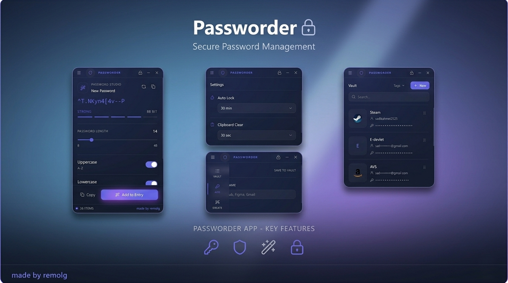
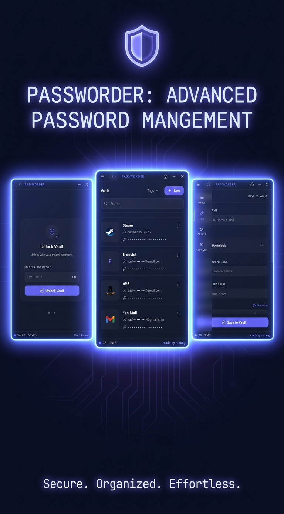

# Passworder

**Passworder**, gizlilik odaklı ve tamamen çevrimdışı çalışan modern bir masaüstü şifre yöneticisidir. Verileriniz buluta gönderilmez; yalnızca kendi cihazınızda, şifrelenmiş şekilde saklanır.

## İndir ve Kullan

Windows kullanıcıları uygulamayı GitHub **Releases** bölümünden indirebilir.

- **Kurulumlu sürüm:** `Passworder-Setup-0.1.0.exe` dosyasını indirip çalıştırın.
- **Taşınabilir sürüm:** `Passworder-Portable-0.1.0-win-x64.zip` dosyasını indirin, zipten çıkarın ve `Passworder.exe` dosyasını çalıştırın.
- Uygulama tamamen yerel çalışır; internet bağlantısı veya hesap gerekmez.

## Temel Özellikler

### Maksimum Güvenlik ve Gizlilik

- **Offline-first mimari:** Sunucu, bulut senkronizasyonu veya telemetri yoktur.
- **Güçlü şifreleme:** Kasa verileri `AES-256-GCM` ile korunur; kasa anahtarı ana şifreden `scrypt` ile türetilir.
- **Yerel depolama:** Veriler diskte yalnızca şifrelenmiş biçimde tutulur.

### Akıllı Araçlar

- **Şifre üretici:** Uzunluk ve karakter seçenekleriyle güçlü şifreler oluşturur.
- **Otomatik kilit:** Belirlenen süre işlem yapılmazsa kasayı kilitler.
- **Pano temizleme:** Kopyalanan şifreleri belirlenen süre sonunda panodan temizler.

### Modern Arayüz

- Electron, React, TypeScript ve Tailwind CSS ile geliştirilmiş sade masaüstü deneyimi.
- Hızlı arama, tek tıkla kopyalama ve kolay kayıt yönetimi.

## Teknik Detaylar

- **Framework:** Electron + React + TypeScript
- **Arayüz:** Tailwind CSS
- **Kripto:** Node.js Crypto (`scrypt`, `AES-256-GCM`)
- **Depolama:** Yerel şifrelenmiş JSON tabanlı kasa

## İletişim

| Platform | Bilgi |
| :--- | :--- |
| Discord | remolgcum |
| E-posta | sadikahmet252525@gmail.com |
| Geliştirici | remolg |

---

Güvenliğiniz sizin elinizde. Passworder ile şifrelerinizi yerel ve şifreli bir kasada saklayın.
