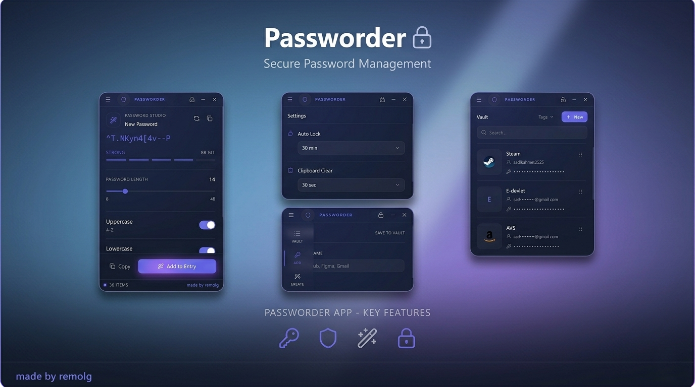
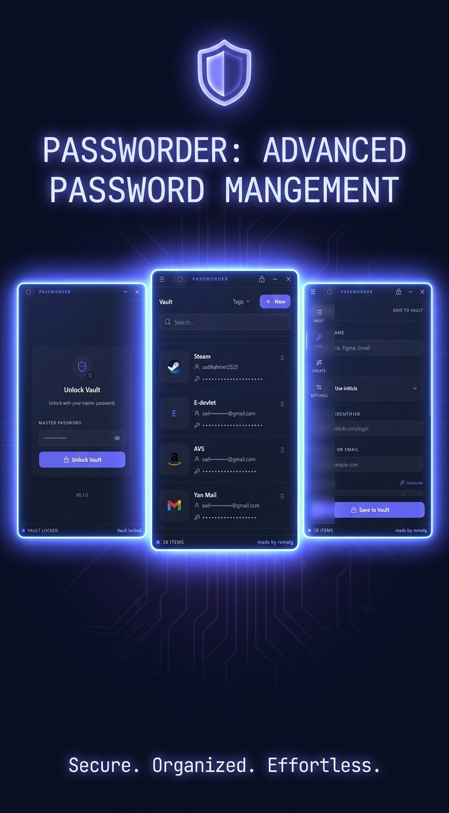
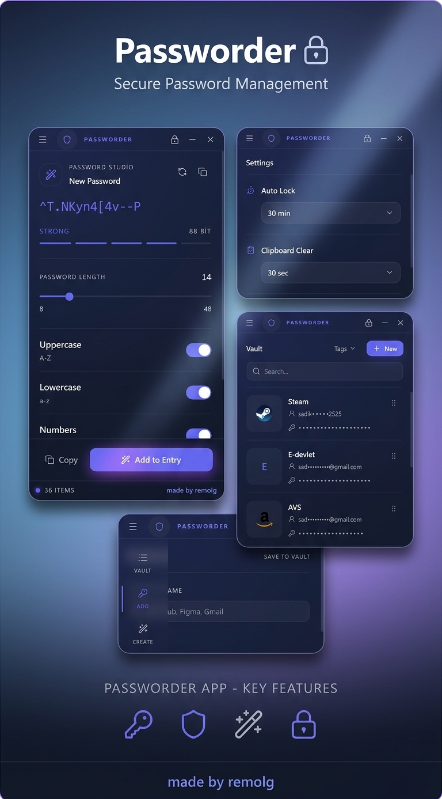

# Passworder

Passworder, gizlilik ve yerel veri güvenliği odağında geliştirilmiş bir masaüstü şifre yöneticisidir. Uygulama internet bağlantısı, kullanıcı hesabı, bulut senkronizasyonu veya harici servis gerektirmeden çalışır. Kasa verileri yalnızca kullanıcının kendi cihazında, şifrelenmiş biçimde saklanır.



## Kullanım

Windows kullanıcıları uygulamayı GitHub Releases bölümünden indirebilir.

- Kurulumlu sürüm için `Passworder-Setup` dosyasını çalıştırın.
- Taşınabilir sürüm için `Passworder-Portable` arşivini çıkarın ve `Passworder.exe` dosyasını açın.
- Uygulama tamamen yerel çalışır; hesap oluşturma veya internet bağlantısı gerekmez.
- Ana şifre unutulursa kasa içeriği geri alınamaz. Bu bilgi güvenlik nedeniyle hiçbir yerde saklanmaz.

## Özellikler

### Yerel ve Şifreli Kasa

- Kasa verileri cihazda şifrelenmiş JSON dosyası olarak tutulur.
- Anahtar türetme işlemi `scrypt` ile yapılır.
- Kasa içeriği `AES-256-GCM` ile korunur.
- Sunucu, telemetri, bulut yedekleme veya uzaktan erişim mekanizması bulunmaz.

### Kayıt Yönetimi

- Servis adı, kullanıcı adı, şifre, URL, not ve etiket alanlarıyla kayıt oluşturma.
- Klasörler ile kayıtları gruplama.
- Kayıt ve klasör sıralamasını sürükle-bırak yöntemiyle düzenleme.
- Servis ve klasör logoları için yerleşik logo seçici.
- Hızlı arama ve etiket filtreleme.

### Güvenlik Araçları

- Ayarlanabilir uzunluk ve karakter seçenekleriyle şifre üretici.
- Belirlenen süre sonunda otomatik kasa kilitleme.
- Kopyalanan kullanıcı adı veya şifreyi belirli süre sonra panodan temizleme.
- Verileri dışa aktarma ve daha sonra içe aktarma desteği.



## Teknik Yapı

| Alan | Kullanılan Teknoloji |
| :--- | :--- |
| Masaüstü | Electron |
| Arayüz | React, TypeScript |
| Stil | Tailwind CSS |
| Kripto | Node.js Crypto |
| Paketleme | electron-builder |
| Depolama | Yerel şifrelenmiş JSON kasa |

## Geliştirme

Projeyi yerel geliştirme ortamında çalıştırmak için:

```bash
npm install
npm run dev
```

Üretim derlemesi almak için:

```bash
npm run build
```

Windows paketi oluşturmak için:

```bash
npm run package:win
```

## Güvenlik Notları

- Ana şifre uygulama tarafından saklanmaz.
- Kasa dosyasının yedeğini almak kullanıcının sorumluluğundadır.
- Bulut senkronizasyonu kullanılacaksa şifrelenmiş kasa dosyasının hangi ortamda tutulacağı kullanıcı tarafından dikkatle seçilmelidir.
- Güncellemeler yayınlanabilir; en güncel kurulum dosyaları için GitHub Releases bölümü takip edilmelidir.



## İletişim

| Platform | Bilgi |
| :--- | :--- |
| Discord | remolgcum |
| E-posta | sadikahmet252525@gmail.com |
| Geliştirici | remolg |

---

Passworder, şifrelerini yerel ve şifreli bir kasada saklamak isteyen kullanıcılar için hazırlanmış modern bir masaüstü uygulamasıdır.
